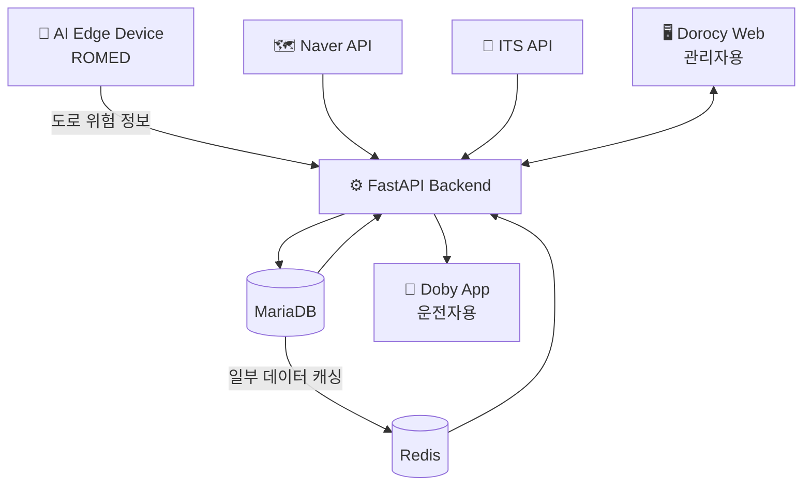

# 🚧 CNED

### 도로 노면 장애 대응 AI 통합 서비스

> AI Edge Device에서 감지한 도로 위험 정보를

> FastAPI 기반 서버를 통해 운전자 앱과 관리자 웹까지

> 실시간으로 연결하는 통합 안전 모니터링 시스템

✅ 5인 팀 프로젝트  

📅 2025.03 \~ 2025.06

---

## 👤 Role

**AI·IoT 모델 개발을 제외한 서비스 설계·구현·통합 전반**

Backend · DB · Auth · Real-time · App · Web · External API · Deployment · CI/CD

---

## 🗺️ Architecture

---

## 🧩 Services

### ⚙️ Backend

FastAPI · SQLAlchemy · MariaDB · Redis · WebSocket

### 📱 Doby

React Native 기반 운전자 앱

### 🖥️ Dorocy

Next.js 기반 관리자 웹

---

## ✨ Key Engineering

- SQLAlchemy 다형성 권한 구조 설계

- Naver Navigation 응답 구조 분석 및 `pointidx` 기반 매핑

- WebSocket 기반 AI Edge Device 데이터 연동

- FastAPI / MariaDB / Redis 분리 배포

- GitHub Actions 기반 CI/CD 구축

---

## 📦 Repositories

| Repository | Description |
|---|---|
| [`c-ned-backend`](https://github.com/C-NED/c-ned-backend) | FastAPI Backend |
| [`c-ned-front-app-doby`](https://github.com/C-NED/c-ned-front-app-doby-) | Driver App |
| [`c-ned-front-web-dorocy`](https://github.com/C-NED/c-ned-front-web-dorocy) | Admin Web |

---

## 📚 More

상세 설계, 개발 과정 및 트러블슈팅 → 

